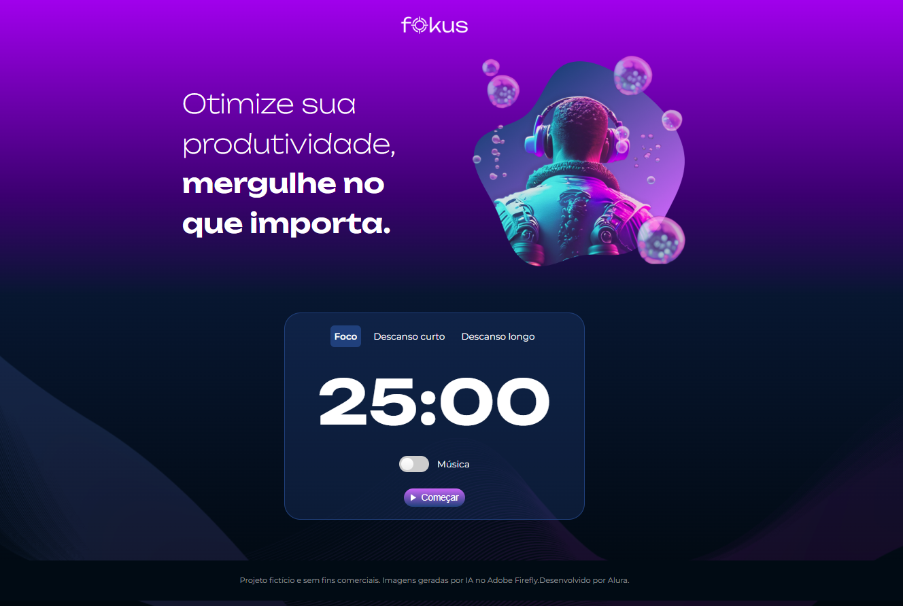

<h1 align="center">Projeto FOKUS</h1>

<h3>Visual desenvolvivdo pelo pessoal do ALURA e manipluação de DOM desenvolvimento por mim.</h3>

O DOM é responsavel por captar sinais do navegador e reagir a eventos na página web. Nesse projeto foi desenvolvimento um sistema de POMODORO  

  <a href="#-Layout">Layout</a>&nbsp;&nbsp;&nbsp;|&nbsp;&nbsp;&nbsp;  
  <a href="#-tecnologias">Tecnologias</a>&nbsp;&nbsp;&nbsp;|&nbsp;&nbsp;&nbsp;

## Layout

<h3 align="center">Foco</h3>

  

 

<h3 align="center">Descanso Curto</h3>

  

<h3 align="center">Descanso Longo</h3>

  

## 🚀 Tecnologias

Esse projeto foi desenvolvido com as seguintes tecnologias:

- JavaScript
- Git e Github
- Figma
